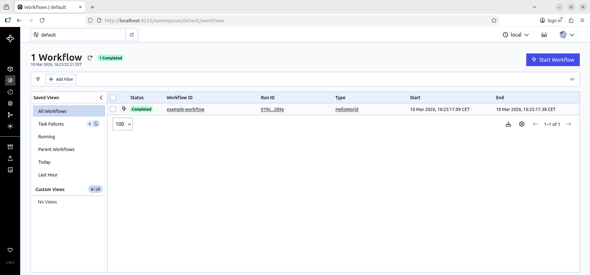
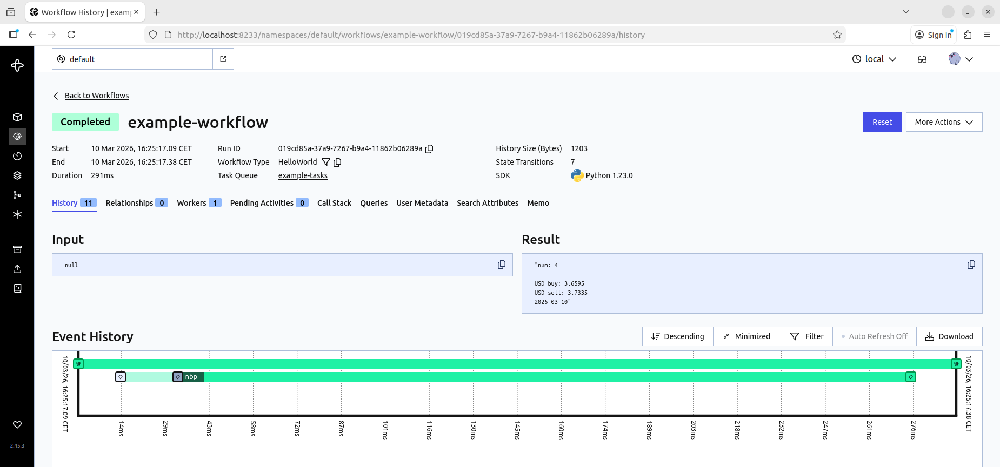
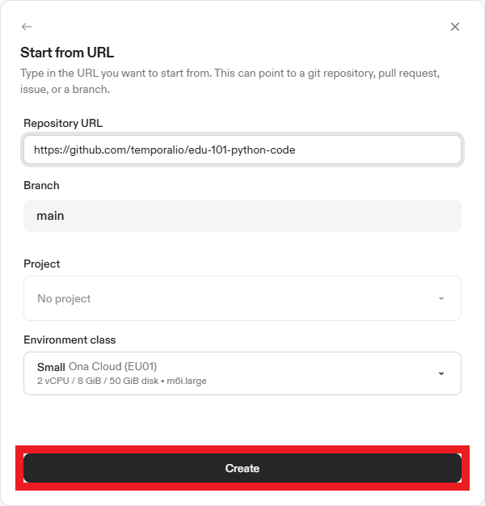
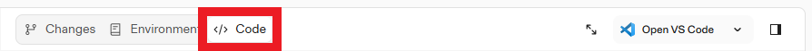
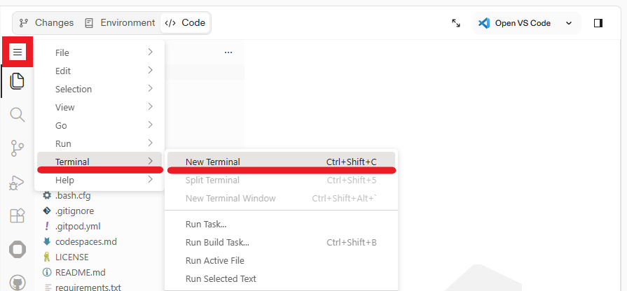

# Orchestrating Mission-Critical Workflows with Temporal and Python

## Table of Contents:
- ### [Option 1: Demo with local development environment](https://github.com/korniichuk/temporal-wdi-2026?tab=readme-ov-file#option-1-demo-with-local-development-environment-1)
- ### [Option 2: Demo with Gitpod (browser-based environment)](https://github.com/korniichuk/temporal-wdi-2026?tab=readme-ov-file#option-2-demo-with-gitpod-browser-based-environment-1)

## Option 1: Demo with local development environment
### Step 1/4: Installation
**Install Temporal CLI**

To install the Temporal CLI, download the version for your architecture:
- [Download Temporal CLI for Linux amd64](https://temporal.download/cli/archive/latest?platform=linux&arch=amd64)
- [Download Temporal CLI for Linux arm64](https://temporal.download/cli/archive/latest?platform=linux&arch=arm64)

For example: `temporal_cli_1.1.2_linux_amd64.tar.gz` file.

Extract the downloaded archive. Example:
```sh
$ tar xzf temporal_cli_1.1.2_linux_amd64.tar.gz
```

Add the `temporal` binary to your `PATH` by copying it to a directory like `/usr/local/bin/`.
Example:
```sh
$ mv temporal /usr/local/bin/
```

**Install Temporal SDK**

Install the Temporal Python SDK:
```sh
$ pip install temporalio
```

**Install [HTTPX](https://github.com/encode/httpx/) Python lib**:
```sh
$ pip install httpx
```

### Step 2/4: Start Temporal Server
Open a new terminal window and run the following command:
```sh
$ temporal server start-dev
```

This command starts a local Temporal Server. It starts the Web UI, creates the `default` [Namespace](3https://docs.temporal.io/namespaces), and uses an in-memory database.

The Temporal Service will be available on `localhost:7233`.
The Temporal Web UI will be available at http://localhost:8233.

Leave the local Temporal Server running. You can stop the Temporal Service at any time later by pressing `Ctrl+C`.

### Step 3/4: Start Temporal Worker
Open a new terminal window and run the following command:
```sh
$ python3 worker.py
```
Leave the Temporal Worker running.

### Step 4/4: Execute Temporal Workflow
Open a new terminal window and run the following command:
```sh
$ python3 app.py
```

Example output:
```sh
num: 4

USD buy: 3.9926
USD sell: 4.0732
2024-12-09
```

Navigate to Temporal Web UI at http://localhost:8233 to see Temporal Workflows:


Click on `example-workflow` Workflow ID to see Temporal Workflow History and Execution Result:


## Option 2: Demo with Gitpod (browser-based environment)
Not everyone is willing to use a local environment and install software for a demo. That is why you can use the Gitpod service with a browser-based environment as an alternative.

### Step 1/4: Clone GitHub repo and install [HTTPX](https://github.com/encode/httpx/) Python lib
Navigate to https://gitpod.io/#https://github.com/temporalio/edu-101-python-code to launch a browser-based environment.

Click the `Create` button:



Change tab from the `Changes` to the `<\> Code`:



Click the hamburger menu (aka three-line icon) icon. Secect `Terminal`, select `New Terminal`:



In this new **first** terminal window execute the following commands:
```sh
$ cd ..
$ git clone https://github.com/korniichuk/temporal-wdi-2026
$ cd temporal-wdi-2026
$ pip install httpx
```

### Step 2/4: Start Temporal Server
Open a new **second** terminal window and run the following command:
```sh
$ temporal server start-dev --ip 0.0.0.0 --ui-ip 0.0.0.0 --port 7233 --ui-port 8233
```

This command starts a local Temporal Server. It starts the Web UI, creates the `default` [Namespace](https://docs.temporal.io/namespaces), and uses an in-memory database.

The Temporal Service will be available on `localhost:7233`.
The Temporal Web UI will be available at http://localhost:8233.

Leave the local Temporal Server running. You can stop the Temporal Service at any time later by pressing `Ctrl+C`.

### Step 3/4: Execute Temporal Workflow
Open a new **third** terminal window and execute the following commands:
```sh
$ cd ..
$ cd temporal-wdi-2026
$ python3 worker.py
```

Leave the Temporal Worker running.

### Step 4/4: Execute Temporal Workflow
In the **first** terminal window, run the following command:
```sh
$ python3 app.py
```

Example output:
```sh
num: 4

USD buy: 3.6595
USD sell: 3.7335
2026-03-10
```

To navigate to Temporal Web UI to see Temporal Workflows, In the **first** terminal window, run the following command:
```sh
$ gitpod environment port open 8233 --name 8233
```

Example output:
```sh
https://8233--019cd868-853b-7ed2-9862-a56d5c6d1c78.eu-central-1-01.gitpod.dev
```

Open the link from the output (e.g., `https://8233--019cd868-853b-7ed2-9862-a56d5c6d1c78.eu-central-1-01.gitpod.dev`) in the new separate tab in your browser.

Click on `example-workflow` Workflow ID to see Temporal Workflow History and Execution Result.

## Sources
- [Set up a local Temporal Service for development with Temporal CLI](https://learn.temporal.io/getting_started/python/dev_environment/?os=linux#set-up-a-local-temporal-development-cluster)
